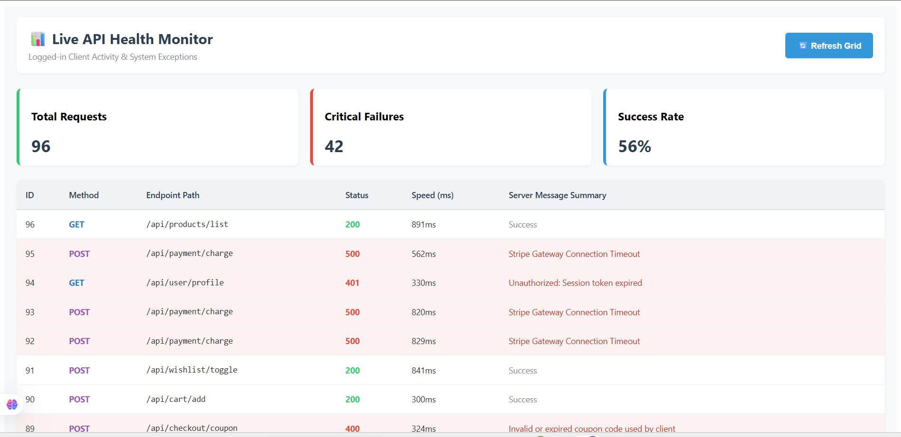
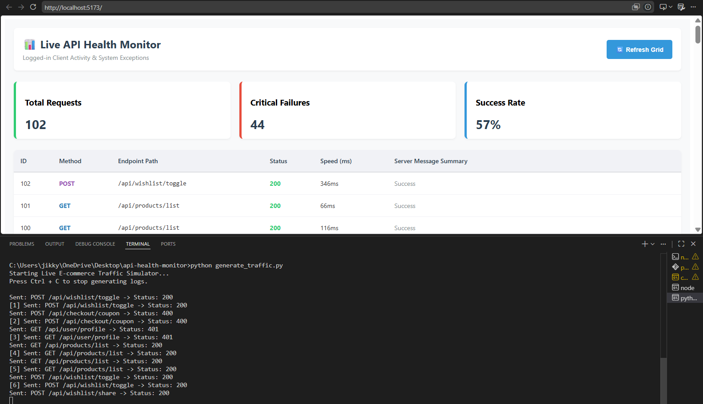

# API Health & Error Monitoring Dashboard

A full stack web application that monitors live API requests, tracks errors, and displays real-time statistics on a dashboard. Built as a personal project to understand how backend systems are monitored in real-world e-commerce applications.

---

## What This Project Does

In real e-commerce platforms, hundreds of API calls happen every second — product listings, cart updates, payments, wishlist toggles. When something breaks, engineers need to see it immediately.

This dashboard:
- Captures every incoming API request with its method, endpoint, status code, and response time
- Highlights failed requests (400s and 500s) in red so errors are visible instantly
- Shows live stats — total requests, critical failures, and success rate
- Auto-refreshes every 5 seconds so the data stays live without manual reload
- Includes a Python traffic simulator that mimics real buyer activity on an e-commerce store

---

## Tech Stack

| Layer | Technology |
|---|---|
| Frontend | React.js |
| Backend | Node.js + Express |
| Database | PostgreSQL |
| DB Connector | node-postgres (pg) |
| Traffic Simulator | Python (requests library) |

---

## Project Structure

```
api-health-monitor/
├── backend/
│   ├── routes/
│   │   └── logs.js        # All API endpoints
│   ├── db.js              # PostgreSQL connection pool
│   ├── server.js          # Main Express server
│   └── .env               # Environment variables (not pushed to GitHub)
├── frontend/
│   └── src/
│       └── App.jsx        # React dashboard UI
├── generate_traffic.py    # Python script to simulate live e-commerce traffic
└── .gitignore
```

---

## API Endpoints

| Method | Endpoint | What it does |
|---|---|---|
| GET | `/api/logs/all` | Fetch all logs from database |
| POST | `/api/logs/create` | Save a new API log entry |
| GET | `/api/logs/errors` | Fetch only failed requests (status 400+) |
| GET | `/api/logs/stats` | Get total, success, failed count and avg response time |

---

## How to Run This Project Locally

### 1. Clone the repository
```bash
git clone https://github.com/pranathikankati/api-health-monitor.git
cd api-health-monitor
```

### 2. Setup the database
- Install PostgreSQL and open psql
- Run these SQL commands:

```sql
CREATE DATABASE api_dashboard;
\c api_dashboard

CREATE TABLE api_logs (
  id SERIAL PRIMARY KEY,
  endpoint VARCHAR(255),
  method VARCHAR(10),
  status_code INT,
  response_time INT,
  error_message TEXT,
  created_at TIMESTAMP DEFAULT CURRENT_TIMESTAMP
);
```

### 3. Setup backend
```bash
cd backend
npm install
```

Create a `.env` file inside the backend folder:
```
DB_HOST=localhost
DB_PORT=5432
DB_NAME=api_dashboard
DB_USER=postgres
DB_PASSWORD=your_postgresql_password
PORT=5000
```

Start the backend:
```bash
node server.js
```

### 4. Setup frontend
```bash
cd frontend
npm install
npm run dev
```

Open your browser at `http://localhost:5173`

### 5. Run the traffic simulator
```bash
pip install requests
python generate_traffic.py
```

This will start sending random e-commerce API requests to the backend every few seconds. Watch the dashboard update live!

---

## Screenshots

> Dashboard showing live API logs with color-coded status codes, error highlighting, and real-time stats




---

## What I Learned

- How to build a REST API with Node.js and Express from scratch
- How to connect Node.js to PostgreSQL using connection pooling
- How to write raw SQL queries (INSERT, SELECT, WHERE, COUNT, AVG, CASE WHEN)
- Why parameterized queries prevent SQL injection attacks
- How CORS works between a React frontend and Express backend
- How to simulate realistic traffic data using Python

---

## Author

**Pranathi Kankati**  
GitHub: [@pranathikankati](https://github.com/pranathikankati)
